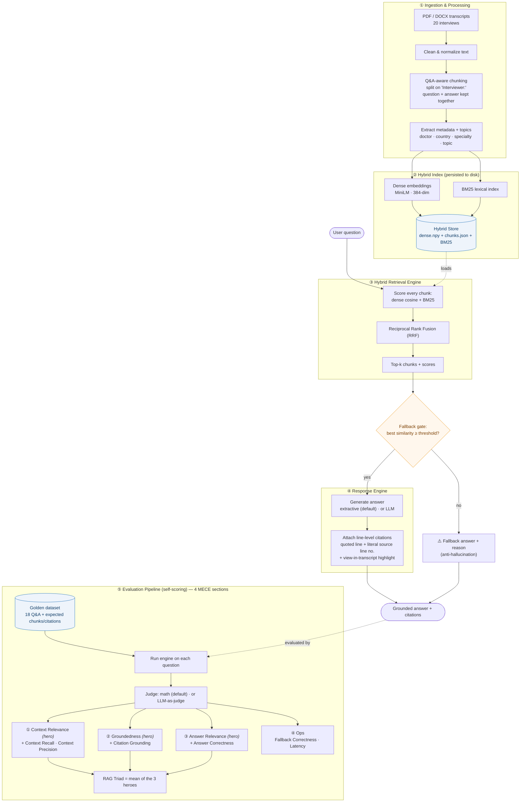

# RAG Pipeline — Current Architecture (flowchart)

This diagram renders automatically on GitHub. It is the **current** configuration
(sentence-transformers embeddings · hybrid retrieval + RRF · extractive generation ·
math judge). Edit the Mermaid block below to keep it in sync as the pipeline evolves.

## Access points (where you trigger each stage)

| Access point | UI | CLI |
|---|---|---|
| ① Ingest & update knowledge base | **Ingest** tab → Build | `python build_index.py` |
| ② Answer a question | **Ask** tab | `python ask.py "..."` |
| ③ Evaluate over golden dataset | **Evaluate** tab → Run | `python run_eval.py` |
